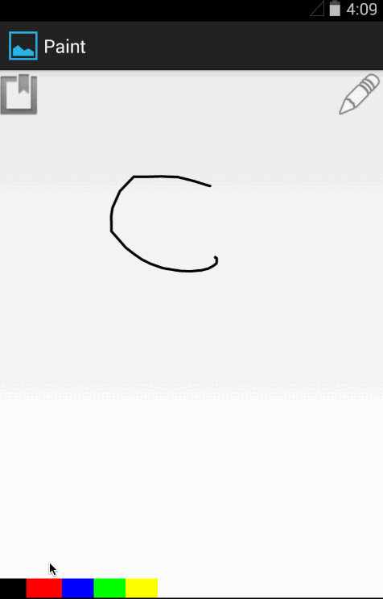

# Android Paint App

This is an Android Paint application. This is a playground to learn about Custom Views, gesture control etc.

Time spent: 3 hours spent in total

Completed user stories:

* [x] User can press down to draw on the canvas.
* [x] User can choose between at least 6 colors to draw with.
* [x] User can choose between at least 3 different brush sizes.
* [x] User can press "New" to clear the canvas and start over.

Notes:

There are a couple hacks which need some work. Bitmap caching is yet to be implemented.

Walkthrough of all user stories:

GIF created with [LiceCap](http://www.cockos.com/licecap/).

